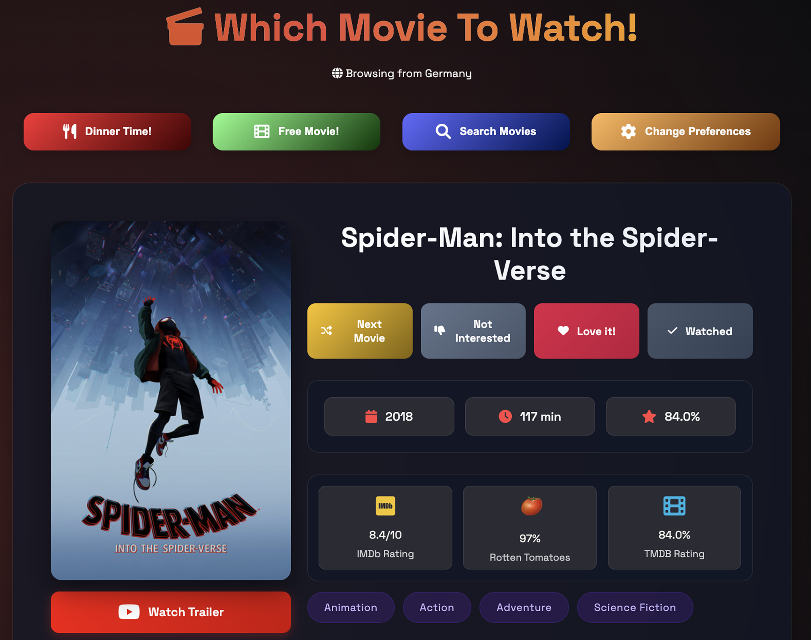

<div align="center">


<br/>

<a href="https://www.whichmovietowatch.online">
  
</a>

<br/><br/>

**Discover your next favourite film — powered by smart recommendations, real-time streaming data, and a beautiful interface.**

<br/>

[](https://www.whichmovietowatch.online)
[](LICENSE)
[](https://www.whichmovietowatch.online)

<br/>

<a href="https://www.whichmovietowatch.online">
  
</a>

<br/><br/>

<p>
  <a href="https://skillicons.dev">
    
  </a>
</p>

[Features](#-features) · [Tech Stack](#-tech-stack) · [Getting Started](#-getting-started) · [Architecture](#-architecture) · [Contributing](#-contributing) · [License](#-license)

</div>

---

## About

**Which Movie To Watch** is a Progressive Web App for movie discovery and recommendations. It connects to TMDB, OMDB, and streaming provider APIs to surface personalised picks based on your taste, region, and mood — all with a polished claymorphic UI, 3D hero scenes, and full offline support.

---

## ✨ Features

| | Feature | Description |
|---|---|---|
| 🎯 | **Smart Discovery** | Taste-learning engine scores movies on genre, decade, and director preferences with progressive filter relaxation |
| 🍽️ | **Dinner Time Mode** | Family-friendly picks — PG-13 max, no horror/thriller, choose Netflix, Disney+, or Prime Video |
| 🔍 | **Advanced Search** | Full-text + voice search, dual-range filters for year, rating, runtime, genre, and language |
| 📊 | **Multi-Source Ratings** | TMDB, IMDb, Rotten Tomatoes, and Metacritic scores in colour-coded badges |
| 🌍 | **Region-Aware** | Auto-detects your country via IP geolocation; shows only locally available streaming options |
| 🎬 | **Free Movies** | Curated 1 000+ legally free YouTube films with TMDB metadata enrichment |
| 📈 | **Trending** | Now-playing and popular movies with 30-minute auto-refresh |
| 🎨 | **Theme System** | Dark and light modes with warm-orange, gold, and clean-white colour presets |
| 🧊 | **3D Hero Scenes** | GPU-detected Spline 3D scenes with gyroscope parallax and automatic 2D fallback |
| 📲 | **PWA** | Installable on iOS and Android with offline caching, background sync, and update prompts |
| ♿ | **Accessible** | ARIA landmarks, keyboard navigation, screen-reader announcements, reduced-motion support |
| 🔗 | **Deep Linking & Sharing** | Shareable movie URLs via Web Share API, dynamic Open Graph meta tags |

<details>
<summary><strong>More feature details</strong></summary>

<br/>

### Discovery Engine
- 5-step progressive filter relaxation ensures you always get a result
- Taste profile builds over time — records loved/skipped genres, decades, directors
- Onboarding wizard: pick your streaming service and favourite genre in 2 steps

### Streaming Providers
- Real-time watch availability from TMDB (subscription, rent, buy, free, ads)
- Provider logos with deep-links to each service
- Manual region override with picker

### Bento Grid Home
- 12-column responsive grid with 7 interactive cells
- Auto-cycling featured movies across cells (5-second interval)
- Staggered scroll-reveal entrance animations

### Animations & Motion
- Framer Motion layout animations and page transitions
- Scroll-reveal and stagger containers
- Micro-interactions on action buttons (heart pulse, checkmark draw)
- Netflix-style dramatic splash screen

### PWA & Caching
- Workbox-powered service worker via vite-plugin-pwa
- API response caching: TMDB (24h), OMDB (7d), images (30d)
- Offline fallback page
- Install banner with 7-day re-prompt delay

</details>

---

## 🛠 Tech Stack

| Layer | Technology |
|---|---|
| **Framework** | React 19, React Router 7 |
| **Language** | TypeScript 5.7 |
| **Build** | Vite 6 |
| **Styling** | Tailwind CSS 4, custom claymorphic design system |
| **State** | Zustand 5 with localStorage persistence |
| **Animation** | Motion (Framer Motion) 11 |
| **3D** | Spline 3D with detect-gpu fallback |
| **Storage** | IndexedDB (idb), localStorage |
| **PWA** | vite-plugin-pwa + Workbox |
| **Icons** | Lucide React |
| **Typography** | Inter, Inter Tight, JetBrains Mono (variable fonts) |
| **APIs** | TMDB, OMDB, IPInfo.io |
| **CI/CD** | GitHub Actions → GitHub Pages |
| **Analytics** | Simple Analytics (GDPR-compliant, cookieless) |

---

## 🚀 Getting Started

### Prerequisites

- **Node.js** 22+
- **TMDB API Key** — [get one here](https://www.themoviedb.org/documentation/api)
- **OMDB API Key** — [register here](http://www.omdbapi.com/apikey.aspx)

### Installation

```bash
# Clone the repository
git clone https://github.com/Kohulan/WhichMovieToWatch.git
cd WhichMovieToWatch

# Install dependencies
npm install

# Create local env file
cat > .env.local << 'EOF'
VITE_TMDB_API_KEY=your_tmdb_key
VITE_OMDB_API_KEY=your_omdb_key
EOF

# Start development server
npm run dev
```

Open [http://localhost:5173](http://localhost:5173) in your browser.

### Build for Production

```bash
npm run build    # outputs to dist/
npm run preview  # preview production build locally
```

---

## 📁 Architecture

<details>
<summary><strong>Project structure</strong></summary>

<br/>

```
src/
├── pages/                  # Route-level page components
├── components/
│   ├── 3d/                # Spline scenes, GPU detection, parallax fallback
│   ├── animation/         # ScrollReveal, StaggerContainer
│   ├── bento/             # BentoGrid, BentoCell, 7 content cells
│   ├── dinner-time/       # Service branding, rotary dial
│   ├── discovery/         # Main discovery page
│   ├── free-movies/       # YouTube movies hero
│   ├── layout/            # Navbar, AppShell, RegionPicker
│   ├── movie/             # MovieHero, RatingBadges, ProviderSection, Actions
│   ├── onboarding/        # Preference wizard
│   ├── pwa/               # InstallBanner, ReloadPrompt
│   ├── search/            # SpotlightInput, filters
│   ├── share/             # ShareButton, ShareMenu, StoryCard, MetaTags
│   ├── trending/          # Trending page hero
│   └── ui/                # ClayCard, ClayBadge, ClayModal, MetalButton, etc.
├── hooks/                  # 25+ custom React hooks
├── stores/                 # Zustand stores (preferences, history, region, theme)
├── services/
│   ├── tmdb/              # TMDB API client (discover, search, providers, details)
│   ├── omdb/              # OMDB ratings client
│   ├── ipinfo/            # IP geolocation client
│   └── cache/             # IndexedDB cache with TTL & SWR
├── lib/                    # Utilities (taste engine, genre map, provider registry)
├── styles/                 # Global CSS (clay.css, metal.css, animations.css)
└── types/                  # Shared TypeScript type definitions
```

</details>

### Data Flow

```
User Action → Zustand Store → TMDB/OMDB API → IndexedDB Cache → React Component
                  ↕                                    ↕
           localStorage                        Service Worker Cache
```

### Key Design Decisions

- **Claymorphic UI** — custom clay and metal CSS surfaces with multi-layer shadows
- **Progressive enhancement** — 3D scenes for high-end GPUs, CSS parallax for mid-tier, static for low-end
- **Taste learning** — genre/decade/director scores accumulate from user actions, no server required
- **Region-first** — streaming availability is always filtered by detected or selected country

---

## 🤝 Contributing

Contributions are welcome! Please follow these steps:

1. Fork the repository
2. Create a feature branch (`git checkout -b feature/amazing-feature`)
3. Commit your changes (`git commit -m 'feat: add amazing feature'`)
4. Push to the branch (`git push origin feature/amazing-feature`)
5. Open a Pull Request

---

## 📜 License

This project is licensed under the **MIT License with Commons Clause**. See [LICENSE](LICENSE) for details.

---

## 🙏 Acknowledgements

| Service | Purpose |
|---|---|
| [TMDB](https://www.themoviedb.org/) | Movie metadata, streaming providers, and discover API |
| [OMDB](http://www.omdbapi.com/) | IMDb, Rotten Tomatoes, and Metacritic ratings |
| [IPInfo.io](https://ipinfo.io/) | IP-based geolocation |
| [Simple Analytics](https://www.simpleanalytics.com/) | Privacy-friendly analytics |

> This product uses the TMDB API but is not endorsed or certified by TMDB.

---

<div align="center">

[](https://www.instagram.com/kohulanr/)
[](https://www.linkedin.com/in/kohulanrajan/)
[](https://github.com/Kohulan/WhichMovieToWatch)

Built with ☕ by [Kohulan Rajan](https://kohulanr.com)


</div>
